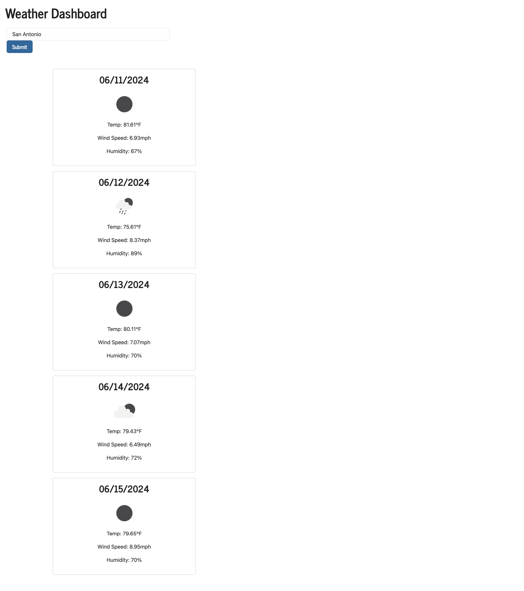

# Weather Dashboard

## Description

This app was made for travellers so that they can view the weather in multiple cities and plan accordingly.

## Usage

To use this app the user will type in a city name into the search bar, press submit and be able to view the cities current weather as well as a 5-day forecast. The information provided will include the date, an icon representation of the weather, temperature, wind speed, and humidity. Once a city is viewed it will be added to the search history and be viewable as a button.

